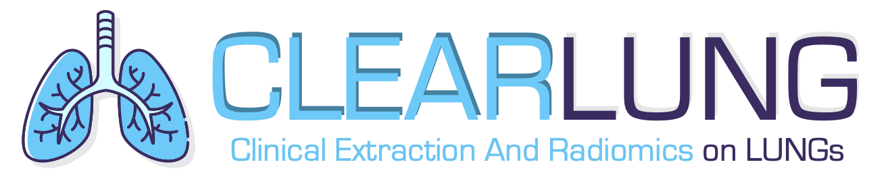

#  

This package provides both clinical and radiomic analysis of pulmonary CT scans.
Clinical features and metris are extracted using techinques described [here](https://pubmed.ncbi.nlm.nih.gov/33567361/), while radiomic features are extracted and passed to a pre-trained classifier (reference [here](https://arxiv.org/abs/2109.13931)) to estimate the probability of COVID-19 versus other viral infections. 
All of the information is then printed on a PDF report for medical use.

Furthermore, this pakage is able to donwload lung CTs from a local PACS node, and to store the produced report onto the same node (with a different series number)

To install and use the package, just run

```bash
git clone git@github.com:niguardateam/covid-classifier.git
cd covid-classifier
sudo pip install -e .
clearlung --help
